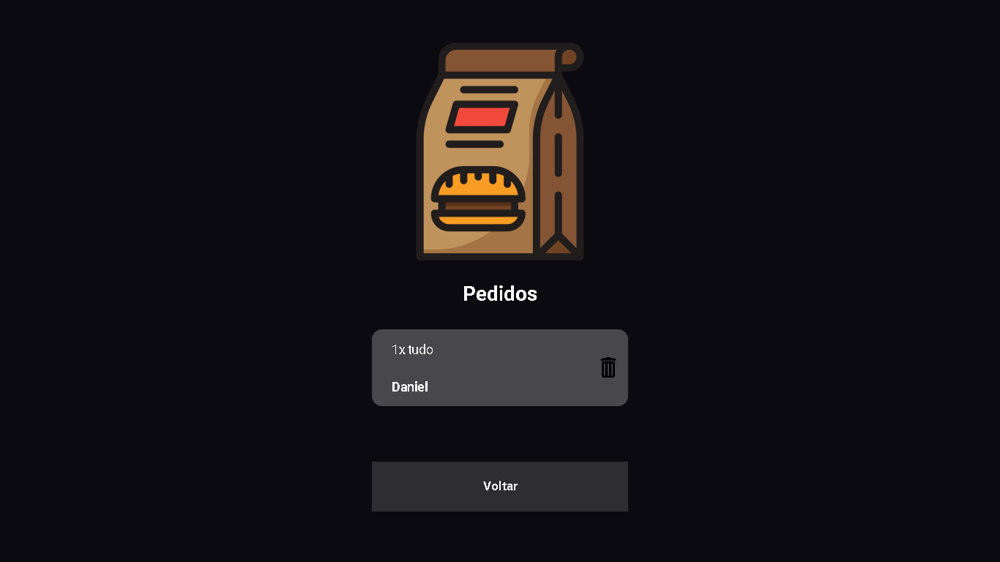

<h1 align="center">
  Mini-Hamburgueria
</h1>

[We are ONLINE, try Now]() :tada: 

<h3 align="left">
  Esse foi um desafio proposto pelo <a href="https://rodolfomori.com.br/devclub/">DevClub</a>
</h3>

 

  <a href="#house-about-the-project">Sobre o Projeto</a>&nbsp;&nbsp;&nbsp;|&nbsp;&nbsp;&nbsp;
  <a href="#computer-technologies">Technologies</a>&nbsp;&nbsp;&nbsp;

 

  

 

## :house: Sobre o projeto

Conduzi o desenvolvimento de um projeto inovador de uma hamburgueria, aplicando tecnologias modernas para oferecer uma experiência única aos usuários. Na camada frontend, utilizei React para criar uma interface dinâmica e responsiva, enquanto no backend, adotei Node.js com o framework Express para gerenciar as requisições de forma eficiente.

Focando na experiência do usuário, implementei recursos como gestão de carrinho de compras e autenticação de usuários. Destaco a comunicação otimizada entre frontend e backend para garantir um desempenho ágil.

Este projeto foi uma oportunidade de consolidar minhas habilidades em React e Node.js, explorando soluções inovadoras para desafios específicos do setor de restaurantes. Estou entusiasmado para continuar aprimorando minhas competências e explorar novas tecnologias no desenvolvimento web. 

 

## :computer: Technologies

- 
- 
- 
- 

Made with ♥ by Daniel Balieiro :wave: [Get in touch!](https://www.linkedin.com/in/daniel-balieiro/)
t
